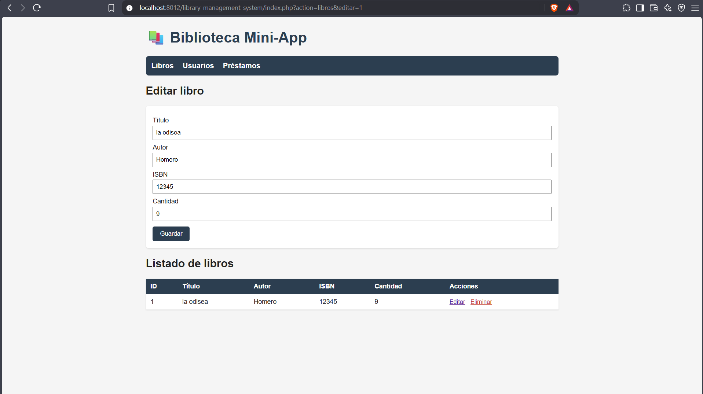
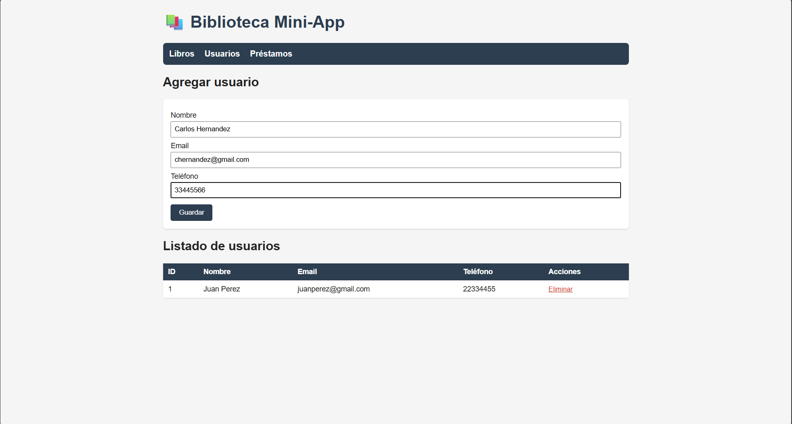
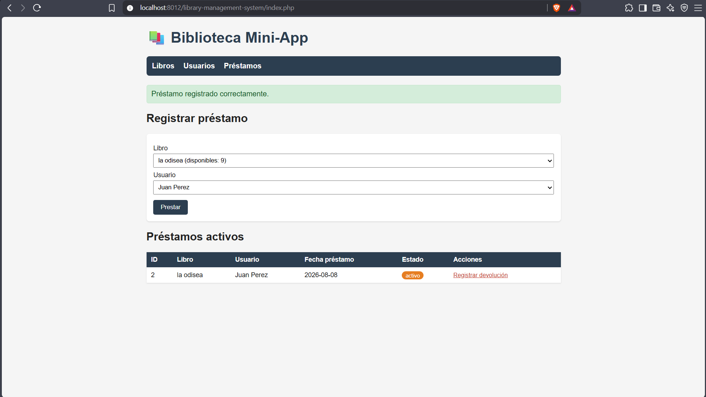

## Documentación de las funcionalidades implementadas

### 1. Gestión de Libros

**Registrar un libro nuevo**
Formulario con título, autor, ISBN y cantidad de ejemplares. Al guardar, se inserta un nuevo registro en la tabla `libros`.

**Listado de libros**
Muestra todos los libros registrados con su cantidad disponible, y acciones para editar o eliminar cada uno.

**Editar libro**
Al dar clic en "Editar" se precarga el formulario con los datos actuales del libro seleccionado (`buscarLibro`), y al guardar se actualiza con `editarLibro`.

**Eliminar libro**
Pide confirmación antes de borrar el registro de la base de datos.

---

### 2. Gestión de Usuarios

**Registrar usuario**
Formulario con nombre, email y teléfono.

**Listado de usuarios**
Muestra todos los usuarios registrados con opción de eliminar.

---

### 3. Gestión de Préstamos

**Registrar préstamo**
Se selecciona un libro y un usuario desde listas desplegables. El sistema valida que haya stock disponible (`cantidad > 0`) antes de crear el préstamo; si no hay ejemplares, muestra un mensaje de error. Al confirmarse, se descuenta una unidad del stock del libro.

**Préstamos activos**
Listado de todos los préstamos con estado `activo`, mostrando el título del libro y el nombre del usuario (obtenidos con `JOIN` entre las tablas `prestamos`, `libros` y `usuarios`).

**Registrar devolución**
Al dar clic en "Registrar devolución", se actualiza el préstamo a estado `devuelto`, se guarda la fecha de devolución y se repone el stock del libro (+1).

